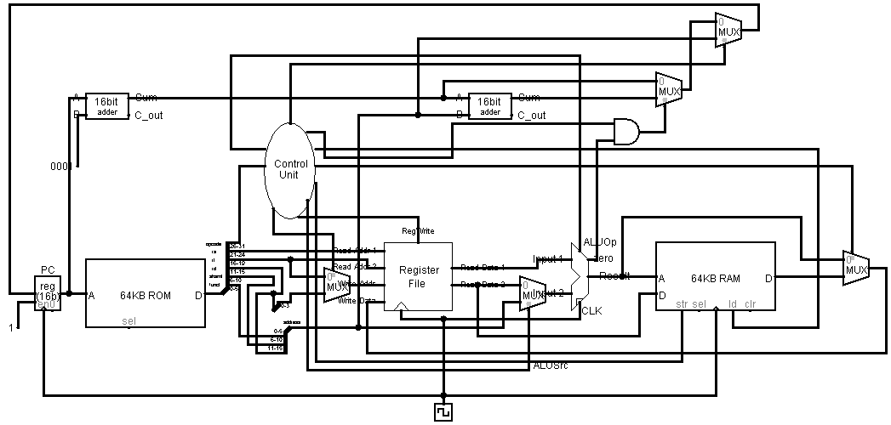
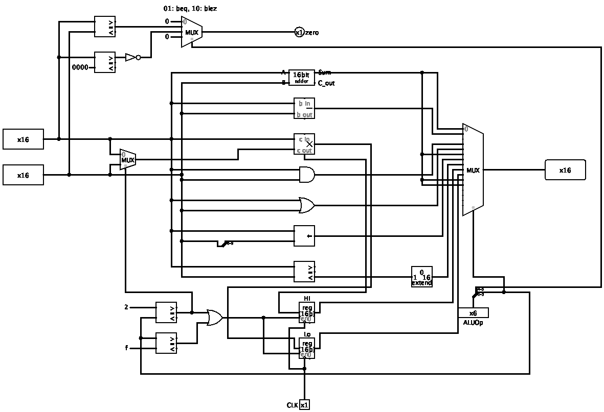
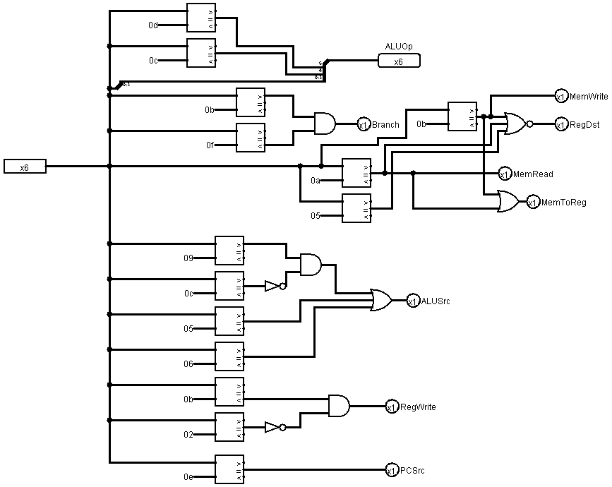
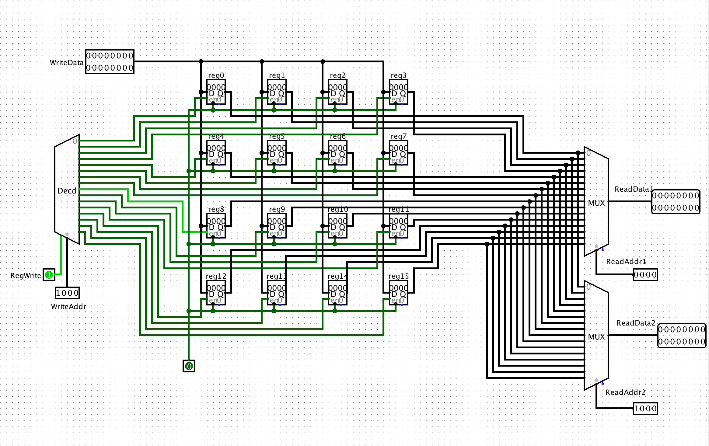
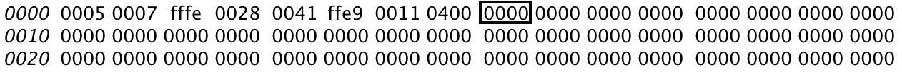
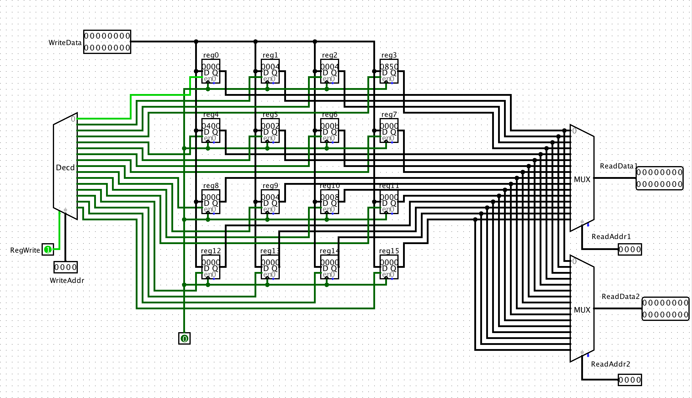
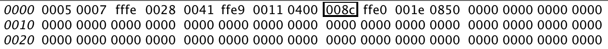
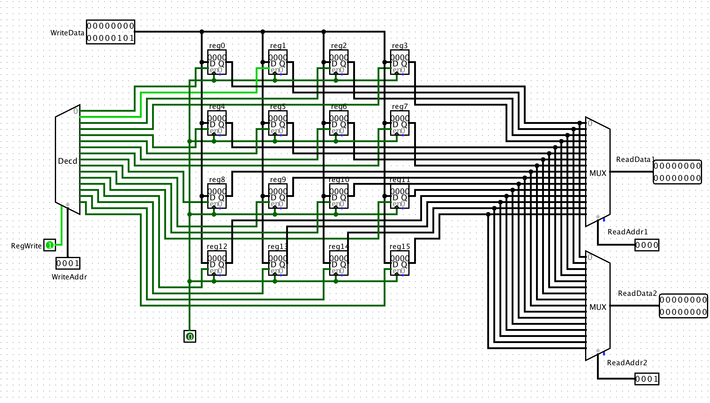

# COMP 303 Final Project - Single Cycle Processor

**Student names:** Ahmet Uysal - Furkan Şahbaz

**Student IDs:** 60780 - 60124

## CPU Design

## Design Description

Our design uses the same instruction format with MIPS ISA (32-bit long instructions). We only utilize lower 4 bits of addresses,
since we only have 16 registers. Also, since our PC only consists of 16 bits, we directly provide the lower 16 bits of the label address in jump operations.
Our instruction memory is addressed by 32 bits. Therefore, we increment the program counter by 1 instead of 4, and we do not multiply the
given jump address by 4.

The control signals that are crucial for operations to be performed are provided by the Control Unit by checking the instructions themselves. After the control
signals are provided, all parts of pur CPU design works accordingly, and by taking cautions against overwriting any necessary data.

All subparts of our CPU design are described below, with all of their inputs, outputs, and tables provided with their corresponding descriptions.

## Supported Instructions

| Instruction         | Opcode | Type | Operation                  |
| ------------------- | ------ | ---- | -------------------------- |
| `add rd, rs, rt`    | 000000 | R    | rd = rs + rt               |
| `sub rd, rs, rt`    | 000001 | R    | rd = rs - rt               |
| `mult rs, rt`       | 000010 | R    | hi;lo = rs\*rt             |
| `and rd, rs, rt`    | 000011 | R    | rd = rs & rt               |
| `or rd, rs, rt`     | 000100 | R    | rd = rs \| rt              |
| `sub rd, rs, rt`    | 000001 | R    | rd = rs - rt               |
| `addi rd, rs, I`    | 000101 | I    | rd = rs + I                |
| `sll rd, rs, shamt` | 000110 | R    | rd = rs << shamt           |
| `slt rd, rs, rt`    | 000111 | R    | rd = (rs < rt)             |
| `mfhi rd`           | 001000 | R    | rd = hi                    |
| `mflo rd`           | 001001 | R    | rd = lo                    |
| `lw rd, i(rs)`      | 001010 | I    | rd = rs[i]                 |
| `sw rs, i(rd)`      | 001011 | I    | rd[i] = rs                 |
| `beq rs, rt, label` | 001100 | I    | if(rs == rt) jump to label |
| `blez rs, label`    | 001101 | I    | if(rs <= 0) jump to label  |
| `j label`           | 001110 | J    | Jump to label              |
| **`sqr rs`**        | 001111 | R    | hi;lo = rs2     |

## Custom Instruction: `sqr`

Our custom instruction `sqr` works in a very similar fashion to the `mult` operation. This time, the provided register is multiplied by itself, instead of another
register. The result is again stored in hi and lo registers that can be found in the ALU, and can be read from them.

## Register File

| Register Number | Conventional Name | Description                                  |
| --------------- | ----------------- | -------------------------------------------- |
| `$0`            | `$zero`           | Hard-wired to 0                              |
| `$1 - $7`       | `$t0 - $t6`       | Temporary data, not preserved by subprograms |
| `$8 - $14`      | `$s0 - $s6`       | Saved registers, preserved by subprograms    |
| `$15`           | `$sp`             | Stack Pointer                                |

### Input Pins

| Name        | Length (bits) | Description                                 |
| ----------- | ------------- | ------------------------------------------- |
| Read Addr 1 | 4             | Register number of first read address       |
| Read Addr 2 | 4             | Register number of second read address 2    |
| RegWrite    | 1             | Control signal that enables write operation |
| Write Addr  | 4             | Register number of write address            |
| Write Data  | 16            | Data to write to write address              |

### Output Pins

| Name        | Length (bits) | Description                                |
| ----------- | ------------- | ------------------------------------------ |
| Read Data 1 | 16            | Data that is read from first read address  |
| Read Data 2 | 16            | Data that is read from second read address |

## ALU

First two bits of the ALUOp indicate branch comparison operations:

| ALUOp  | Operation               | Description                 |
| ------ | ----------------------- | --------------------------- |
| 01XXXX | zero = Input1 == Input2 | zero = 1 if Input1 = Input2 |
| 10XXXX | zero = Input1 <= 0      | zero = 1 if Input1 <= 0     |

Last four bits of the ALUOp indicate ALU operations

| ALUOp  | Operation                   |
| ------ | --------------------------- |
| XX0000 | Result = Input1 + Input 2   |
| XX0001 | Result = Input1 - Input 2   |
| XX0010 | hi;lo = Input 1 \* Input 2  |
| XX0011 | Result = Input1 ∧ Input 2   |
| XX0100 | Result = Input1 ∨ Input 2   |
| XX0101 | Result = Input1 + Immidate  |
| XX0110 | Result = Input 1 << Input 2 |
| XX0111 | Result = Input1 < Input 2   |
| XX1000 | Result = hi                 |
| XX1001 | Result = lo                 |
| XX1111 | hi;lo = Input 12 |

### Input Pins

| Name    | Length (bits) | Description                                         |
| ------- | ------------- | --------------------------------------------------- |
| ALUOp   | 6             | Control signal to indicate ALU \& Branch Operations |
| Input 1 | 16            | First input to ALU Operation                        |
| Input 2 | 16            | Second input to ALU Operation                       |
| CLK     | 1             | Clock                                               |

### Output Pins

| Name   | Length (bits) | Description                                                  |
| ------ | ------------- | ------------------------------------------------------------ |
| Result | 16            | Result of the ALU Operation                                  |
| zero   | 1             | Used for branch comparison operations, =1 if check is passed |

### Sub Components

#### Full Adder

##### Input Pins

| Name           | Length (bits) |
| -------------- | ------------- |
| A              | 1             |
| B              | 1             |
| Cin | 1             |

##### Output Pins

| Name            | Length (bits) |
| --------------- | ------------- |
| Sum             | 1             |
| Cout | 1             |

#### 16-Bit Adder

##### Input Pins

| Name | Length (bits) |
| ---- | ------------- |
| A    | 16            |
| B    | 16            |

##### Output Pins

| Name            | Length (bits) |
| --------------- | ------------- |
| Sum             | 16            |
| Cout | 1             |

## Control Unit

### Input Pins

| Name   | Length (bits) | Description                                       |
| ------ | ------------- | ------------------------------------------------- |
| opcode | 6             | Operation code, highest 6 bits of the instruction |

### Output Pins

| Name     | Length (bits) | Description                                                                                 |
| -------- | ------------- | ------------------------------------------------------------------------------------------- |
| RegDst   | 1             | Chooses write address of Register File, between rt and rd                                   |
| RegWrite | 1             | Enables writing on registers                                                                |
| ALUOp    | 6             | ALU operation code (check ALU section for more information)                                 |
| ALUSrc   | 1             | Determines whether the second input to the ALU will be from Immediate region or Read Data 2 |
| MemToReg | 1             | Determines whether the write data will be taken direclty from ALU result or the data memory |
| MemRead  | 1             | Enables data memory reads                                                                   |
| MemWrite | 1             | Enables data memory writes                                                                  |
| Branch   | 1             | Indicates that PC value may come from a branch operation                                    |
| PCSrc    | 1             | Indicates that PC value will come from an unconditional branch operation                    |

### Output Pin Values According to opcode

| opcode | RegDst | RegWrite | ALUOp  | ALUSrc | MemToReg | MemRead | MemWrite | Branch | PCSrc |
| ------ | ------ | -------- | ------ | ------ | -------- | ------- | -------- | ------ | ----- |
| 000000 | 1      | 1        | 000000 | 0      | 0        | 0       | 0        | 0      | 0     |
| 000001 | 1      | 1        | 000001 | 0      | 0        | 0       | 0        | 0      | 0     |
| 000010 | 1      | 0        | 000010 | 0      | 0        | 0       | 0        | 0      | 0     |
| 000011 | 1      | 1        | 000011 | 0      | 0        | 0       | 0        | 0      | 0     |
| 000100 | 1      | 1        | 000100 | 0      | 0        | 0       | 0        | 0      | 0     |
| 000101 | 0      | 1        | 000101 | 1      | 0        | 0       | 0        | 0      | 0     |
| 000110 | 1      | 1        | 000110 | 1      | 0        | 0       | 0        | 0      | 0     |
| 000111 | 1      | 1        | 000111 | 0      | 0        | 0       | 0        | 0      | 0     |
| 001000 | 1      | 1        | 001000 | 0      | 0        | 0       | 0        | 0      | 0     |
| 001001 | 1      | 1        | 001001 | 0      | 0        | 0       | 0        | 0      | 0     |
| 001010 | 0      | 1        | 001010 | 1      | 1        | 1       | 0        | 0      | 0     |
| 001011 | 0      | 0        | 001011 | 1      | 1        | 0       | 1        | 0      | 0     |
| 001100 | 1      | 0        | 001100 | 0      | 0        | 0       | 0        | 1      | 0     |
| 001101 | 1      | 0        | 001101 | 1      | 0        | 0       | 0        | 1      | 0     |
| 001110 | 1      | 0        | 001110 | 1      | 0        | 0       | 0        | 1      | 1     |
| 001111 | 1      | 0        | 001111 | 1      | 0        | 0       | 0        | 0      | 0     |

## Testing the CPU

### Vector Addition & Scaling

#### Initial State

##### Register File

##### Data Memory

#### Final State

##### Register File

##### Data Memory

### Squaring

#### Initial State of Register File

#### Final State of Register File

