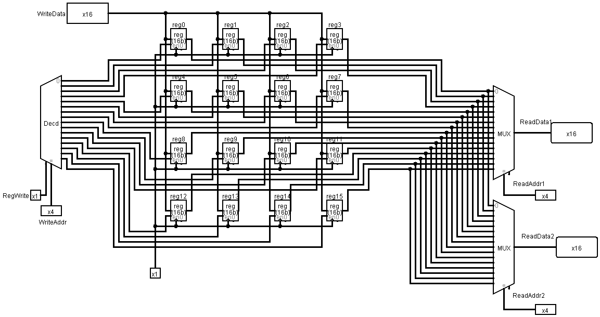

# COMP 303 Final Project - Single Cycle Processor

**Student names:** Ahmet Uysal - Furkan Şahbaz

**Student IDs:** 60780 - 60124

## CPU Design

## Design Description

## Supported Instructions

| Instruction         | Opcode | Type | Operation                  |
| ------------------- | ------ | ---- | -------------------------- |
| `add rd, rs, rt`    | 000000 | R    | rd = rs + rt               |
| `mult rs, rt`       | 000010 | R    | hi;lo = rs\*rt             |
| `and rd, rs, rt`    | 000011 | R    | rd = rs & rt               |
| `or rd, rs, rt`     | 000100 | R    | rd = rs \| rt              |
| `sub rd, rs, rt`    | 000001 | R    | rd = rs - rt               |
| `addi rd, rs, I`    | 000101 | I    | rd = rs + I                |
| `sll rd, rs, shamt` | 000110 | R    | rd = rs << shamt           |
| `slt rd, rs, rt`    | 000111 | R    | rd = (rs < rt)             |
| `mfhi rd`           | 001000 | R    | rd = hi                    |
| `mflo rd`           | 001001 | R    | rd = lo                    |
| `lw rd, i(rs)`      | 001010 | I    | rd = rs[i]                 |
| `sw rs, i(rd)`      | 001011 | I    | rd[i] = rs                 |
| `beq rs, rt, label` | 001100 | I    | if(rs == rt) jump to label |
| `blez rs, label`    | 001101 | I    | if(rs <= 0) jump to label  |
| `j label`           | 001110 | J    | Jump to label              |
| `**sqr rs**`        | 001111 | R    | hi;lo = rs2     |

## Custom Instruction: `sqr`

## Register File

| Register Number | Conventional Name | Description                                  |
| --------------- | ----------------- | -------------------------------------------- |
| `$0`            | `$zero`           | Hard-wired to 0                              |
| `$1 - $7`       | `$t0 - $t6`       | Temporary data, not preserved by subprograms |
| `$8 - $14`      | `$s0 - $s6`       | Saved registers, preserved by subprograms    |
| `$15`           | `$sp`             | Stack Pointer                                |

### Input Pins

| Name        | Length (bits) | Description                                 |
| ----------- | ------------- | ------------------------------------------- |
| Read Addr 1 | 4             | Register number of first read address       |
| Read Addr 2 | 4             | Register number of second read address 2    |
| RegWrite    | 1             | Control signal that enables write operation |
| Write Addr  | 4             | Register number of write address            |
| Write Data  | 16            | Data to write to write address              |

### Output Pins

| Name        | Length (bits) | Description                                |
| ----------- | ------------- | ------------------------------------------ |
| Read Data 1 | 16            | Data that is read from first read address  |
| Read Data 2 | 16            | Data that is read from second read address |

## ALU

First two bits of the ALUOp indicate branch comparison operations:

| ALUOp  | Operation               | Description                 |
| ------ | ----------------------- | --------------------------- |
| 01XXXX | zero = Input1 == Input2 | zero = 1 if Input1 = Input2 |
| 10XXXX | zero = Input1 <= 0      | zero = 1 if Input1 <= 0     |

Last four bits of the ALUOp indicate ALU operations

| ALUOp  | Operation                   |
| ------ | --------------------------- |
| XX0000 | Result = Input1 + Input 2   |
| XX0001 | Result = Input1 - Input 2   |
| XX0010 | hi;lo = Input 1 \* Input 2  |
| XX0011 | Result = Input1 ∧ Input 2   |
| XX0100 | Result = Input1 ∨ Input 2   |
| XX0101 | Result = Input1 + Immidate  |
| XX0110 | Result = Input 1 << Input 2 |
| XX0111 | Result = Input1 < Input 2   |
| XX1000 | Result = hi                 |
| XX1001 | Result = lo                 |
| XX1111 | hi;lo = Input 12 |

### Input Pins

| Name    | Length (bits) | Description                                         |
| ------- | ------------- | --------------------------------------------------- |
| ALUOp   | 6             | Control signal to indicate ALU \& Branch Operations |
| Input 1 | 16            | First input to ALU Operation                        |
| Input 2 | 16            | Second input to ALU Operation                       |
| CLK     | 1             | Clock                                               |

### Output Pins

| Name   | Length (bits) | Description                                                  |
| ------ | ------------- | ------------------------------------------------------------ |
| Result | 16            | Result of the ALU Operation                                  |
| zero   | 1             | Used for branch comparison operations, =1 if check is passed |

### Sub Components

#### Full Adder

##### Input Pins

| Name           | Length (bits) |
| -------------- | ------------- |
| A              | 1             |
| B              | 1             |
| Cin | 1             |

##### Output Pins

| Name            | Length (bits) |
| --------------- | ------------- |
| Sum             | 1             |
| Cout | 1             |

#### 16-Bit Adder

##### Input Pins

| Name | Length (bits) |
| ---- | ------------- |
| A    | 16            |
| B    | 16            |

##### Output Pins

| Name            | Length (bits) |
| --------------- | ------------- |
| Sum             | 16            |
| Cout | 1             |

## Control Unit

### Input Pins

| Name   | Length (bits) | Description                                       |
| ------ | ------------- | ------------------------------------------------- |
| opcode | 6             | Operation code, highest 6 bits of the instruction |

### Output Pins

| Name     | Length (bits) | Description                                                                                 |
| -------- | ------------- | ------------------------------------------------------------------------------------------- |
| RegDst   | 1             | Chooses write address of Register File, between rt and rd                                   |
| RegWrite | 1             | Enables writing on registers                                                                |
| ALUOp    | 6             | ALU operation code (check ALU section for more information)                                 |
| ALUSrc   | 1             | Determines whether the second input to the ALU will be from Immediate region or Read Data 2 |
| MemToReg | 1             | Determines whether the write data will be taken direclty from ALU result or the data memory |
| MemRead  | 1             | Enables data memory reads                                                                   |
| MemWrite | 1             | Enables data memory writes                                                                  |
| Branch   | 1             | Indicates that PC value may come from a conditional branch operation                        |
| PCSrc    | 1             | Indicates that PC value will come from an unconditional branch operation                    |
